# CMS无代码-短信跳转小程序教程

### 写在前面
你可以通过[视频演示](https://v.qq.com/x/page/l3220gydelg.html)的方式学习本教程，更加利于学习和理解。

### 一、能力介绍

境内非个人主体的认证的小程序，开通静态网站并后，可以免鉴权下发支持跳转到相应小程序的短信。短信中会包含支持在微信内或微信外打开的静态网站链接，用户打开页面后可一键跳转至你的小程序。

这个链接的网页在外部浏览器是通过 URL Scheme 的方式来拉起微信打开主体小程序的。

本教程将介绍如何操作开通CMS内容管理系统进而操作使用短信跳转小程序能力，全程无需写代码。

如果你想要进行自定义开发，可以参照[自定义开发教程](https://developers.weixin.qq.com/community/develop/doc/000ae2a7a7c9402a4d8bca2875b409)进行逐步实现

### 二、操作步骤

##### 1.下载微信开发者工具

访问[微信公众平台工具下载页](https://developers.weixin.qq.com/miniprogram/dev/devtools/nightly.html)，按照自己的系统版本下载安装开发者工具。建议安装【开发版 Nightly Build】版本。
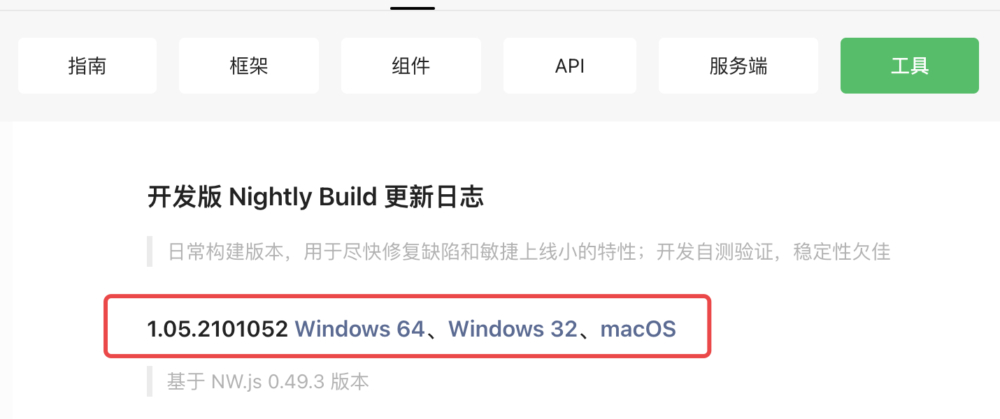

##### 2.打开开发者工具并登录

安装完开发者工具后，打开工具会弹出二维码登录框。使用你目标小程序具有开发者权限的微信号扫码登录。

点击创建小程序+号，会有自动填写默认名称和目录，你可以直接默认，当然也可以自定义路径和名称；在APPID处填写你目标小程序的appid；后端服务选择【小程序·云开发】
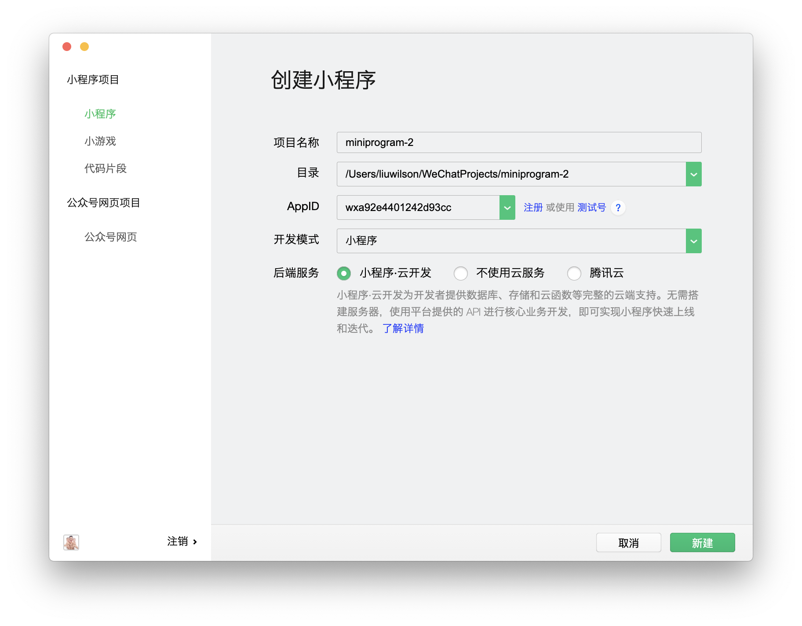

设置完毕后，点击新建，等待项目创建完成并全部加载完毕，最终效果如下：
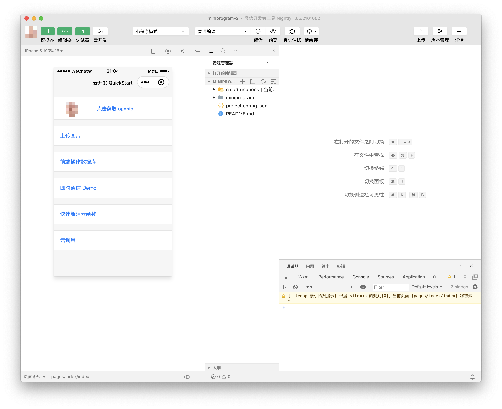

##### 3.开通云开发并创建环境

如果你之前从未使用过云开发，点击左上角工具栏中的【云开发】按钮，会弹出一个窗口，显示如下：
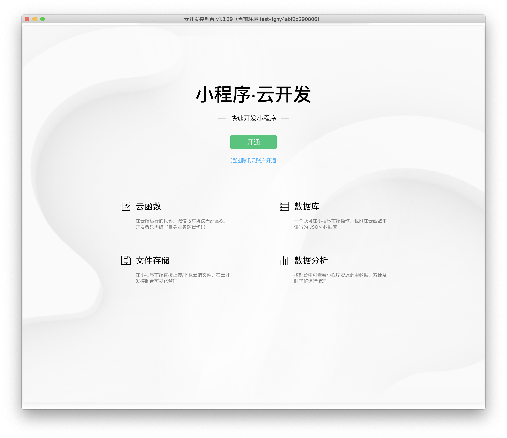

此时只需要点击开通按钮，并在弹出提示框中同意【服务协议】，即可开通云开发。

**注意这里的开通是创建一个新的腾讯云账号，如果你不想有太多的账号，可以选择通过已有的腾讯云账号开通，会绑定你目前的已有腾讯云账号，在统一管理和计费方面更加方便。**

开通之后需要创建一个云开发环境，上一步同意之后会自动弹出创建窗口，效果如下：
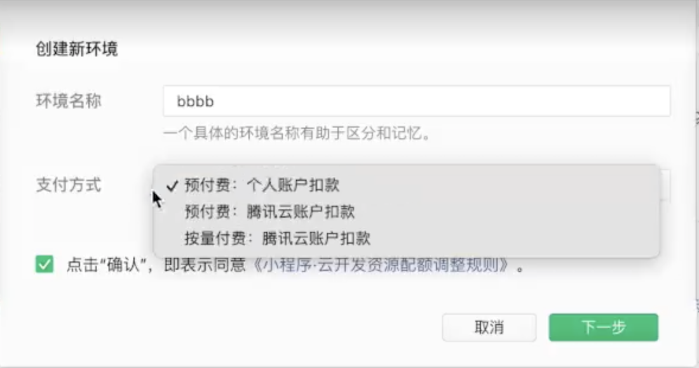

这个时候，我们需要选择【按量付费：腾讯云账户扣款】，创建一个按量付费环境。

如果你之前已经使用过云开发了，建议可以创建一个新的环境。每一个微信小程序有两个免费环境，所以可以创建一个新的按量付费环境（有免费额度），或者2个环境转其中一个为按量付费环境（依然有免费额度）

##### 4.开通内容管理CMS

我们创建一个按量计费环境之后，就进入这个环境的控制台了。我们只需要在顶部导航栏中选择【更多-内容管理】，进入内容管理开通页面，效果如下：
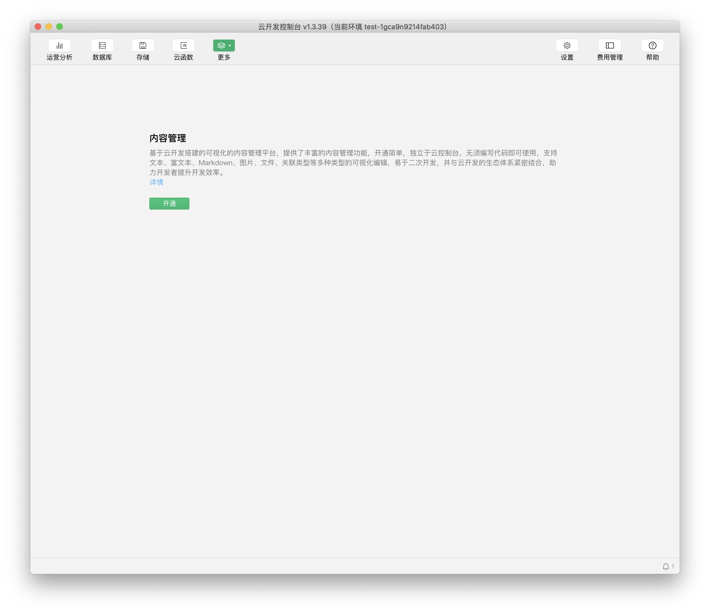

我们点击开通按钮，会弹出一个确认窗口，告诉我们是在环境中部署CMS应用，需要的资源。
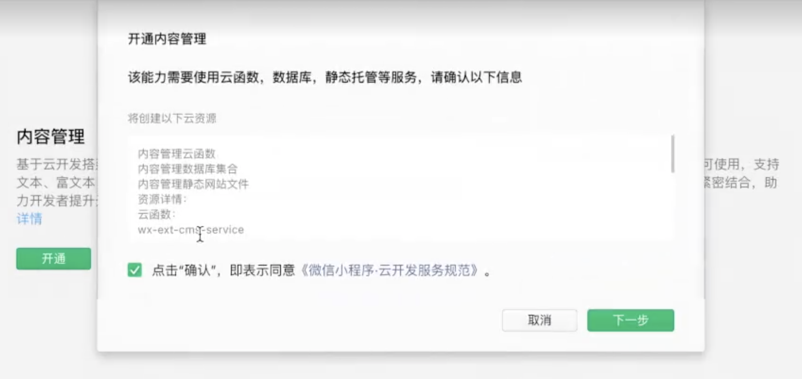

点击下一步后，会弹出管理员设置框，我们输入管理员的ID和密码即可。
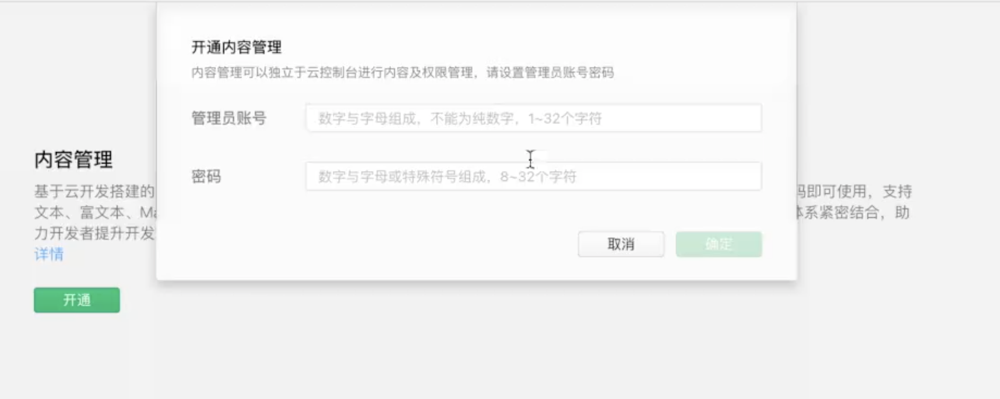

确定之后，内容管理就进入部署阶段，大约3分钟左右。完成之后效果如下：
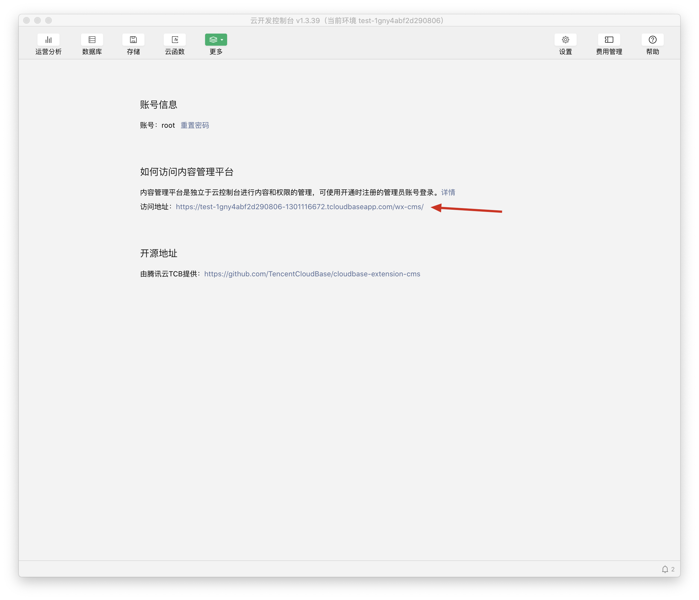

我们只需要打开访问地址，通过浏览器进入内容管理平台，输入我们设置的密码就可以进入内容管理的主页了
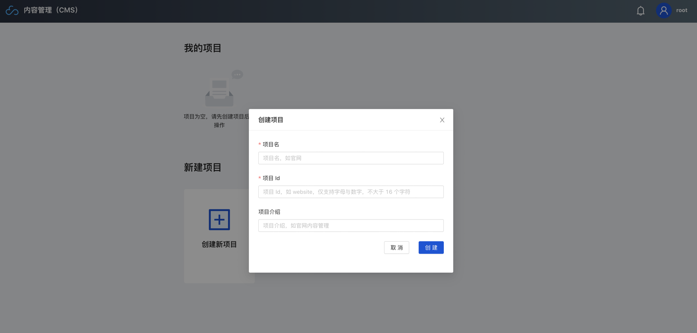

我们在上图所示页面，点击【创建新项目】，弹出创建项目信息框，随意输入名称和ID，比如在这里我们输入名称为「短信」，id为「SMS」

创建成功后会在我的项目中有对应名字的项目，如下图所示：
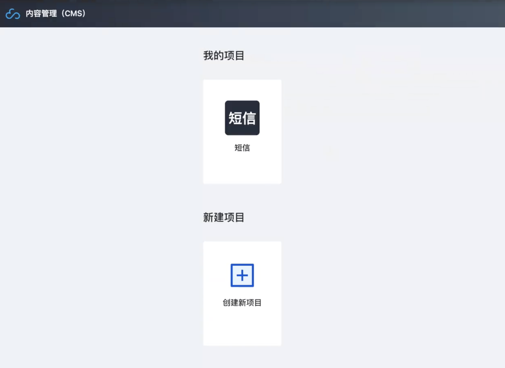

我们点击项目，进入项目的详情，如下图所示：
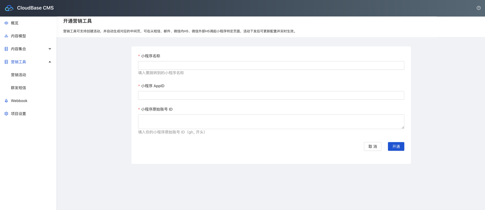

##### 4.创建短信活动项目
进入项目详情后，我们发现左侧栏会有【营销工具】，我们点击其中的营销活动
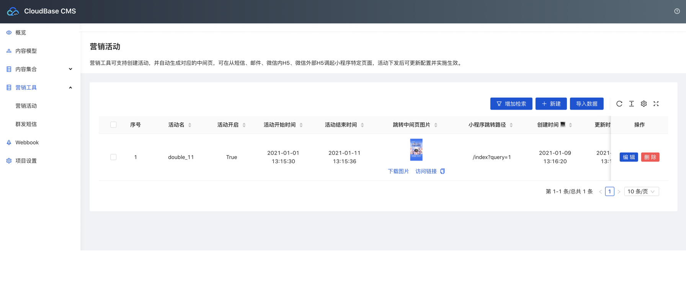

在右上角点击【新建】按钮，创建一个新的活动，内容信息如下：

- 活动名：用来标记描述活动的名称
- 活动开启：是否开启活动，如果关闭活动，将不能通过页面拉起小程序。
- 活动开闭时间：在开启时间内，才可以正常的拉起小程序
- 跳转中间页图片：建议海报，用于在跳转页中展示大图，可以不上传，会有默认样式。
- 小程序跳转路径：已发布上线的小程序中页面路径，不填则默认首页。
- 小程序跳转参数：附带路径的传入参数，一般配合小程序代码联动。

我们创建一个活动后展示如上图所示

##### 5.创建短信群发任务

在左侧栏点击【群发短信】，进入群发短信页面，点击右上角新建群发，进入信息页。
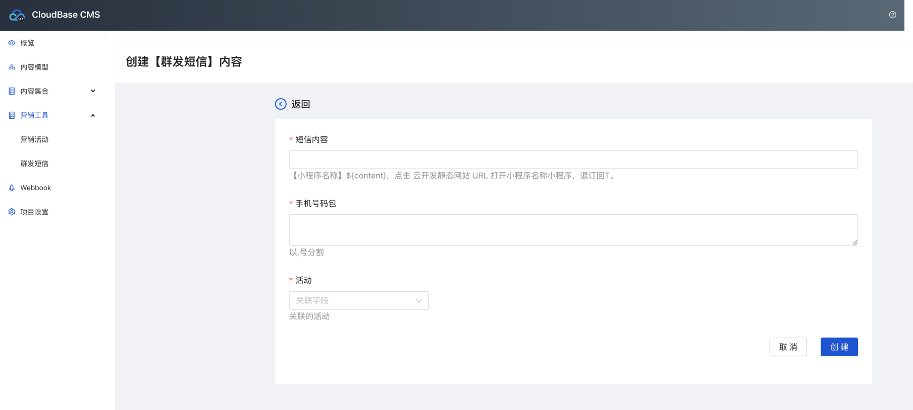

我们需要填写以下3个信息：

- 短信内容：实际发送时目标手机收到的短信内容，短信的前后缀无法自定义。
- 手机号码包：发送的目标手机号，可以填写一个或多个手机号，用回车或者逗号分割。
- 活动：选择刚才我们创建的活动

填写完毕后，我们点击【创建】按钮，系统会自动进行短信发送，此时我们便可以在目标手机号中收到短信了。

在群发短信的页面列表中，可以查看短信的发送状态，以及每一个手机的接收情况。
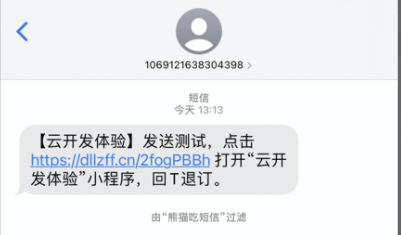

##### 6.测试短信跳转小程序
点击短信的链接后，会跳转到浏览器打开链接，展示如下效果（左默认、右海报）
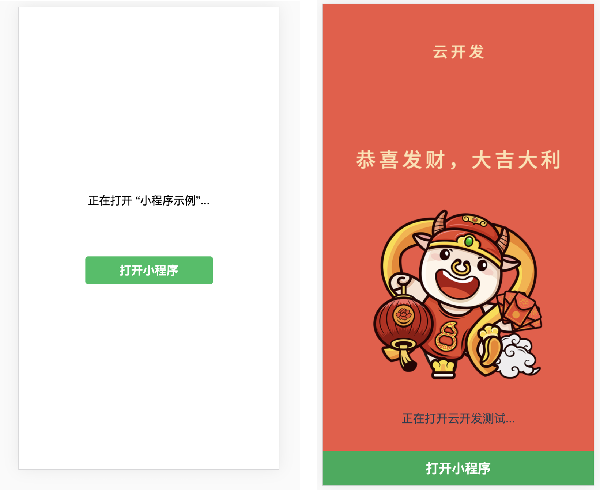

一般页面会自动拉起微信打开小程序，个别机型或浏览器有拦截会导致打开失败，需要手动点击按钮才可以打开。

##### 7.投放外部平台
短信的链接可以复制发布到其他外部平台。

### 总结

1. 短信发送能力的体验是1000条，如果有大规模使用的需要，可以联系官方增加。
2. 短信发送能力支持小程序和小游戏
3. 发送国内短信的号码是1069开头，尾数是运营商随机号的号码
4. 发送成功代表请求发送短信成功，短信异步下发，实际状态以运营商回执为准。没有发送成功的短信不计费,可用性参阅[服务等级协议](https://cloud.tencent.com/document/product/382/15628)
5. 相同内容短信对同一个手机号，30 秒内发送短信条数不超过1条；对同一个手机号，1自然日内发送短信条数不超过10条。

